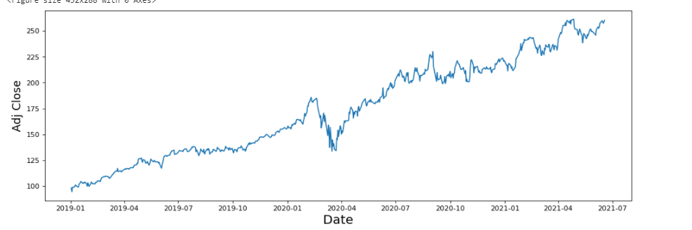

 
# Predicting Microsoft stock 

In this project I consumed the latest stock data from yahoo strating 2019. Given the closing stock, the target here is to predict the next day's stock.

## Project Set Up and Installation
In this project I used AzureML forecasting tool (ensemble of forecasting models - [Set up AutoML training with Python](https://docs.microsoft.com/en-us/azure/machine-learning/how-to-configure-auto-train)

## Dataset
### Overview

The data is a daily Microsoft stock that I reads through Yahoo finance. pandas has a simple remote data access for the Yahoo Finance API data. data.DataReader returns a Panel object, which can be thought of as a 3D matrix. The first dimension consists of the various fields Yahoo Finance returns for a given instrument, namely, the Open, High, Low, Close and Adj Close prices for each date. The second dimension contain the dates.

### Task
Here in this project I used two main tools; AzureML and LSTM to predict daily MSstock.I have created a hyperparameter experiments to run LSTM as well as AzureML and compared their results.

### Access
    # import the dataset from Yahoo finance
     MSFT = data.DataReader('MSFT', 'yahoo',start='1/1/2019')
     
      

## Automated ML
*TODO*: Give an overview of the `automl` settings and configuration you used for this experiment

### Results
*TODO*: What are the results you got with your automated ML model? What were the parameters of the model? How could you have improved it?

*TODO* Remeber to provide screenshots of the `RunDetails` widget as well as a screenshot of the best model trained with it's parameters.

## Hyperparameter Tuning
*TODO*: What kind of model did you choose for this experiment and why? Give an overview of the types of parameters and their ranges used for the hyperparameter search

### Results
*TODO*: What are the results you got with your model? What were the parameters of the model? How could you have improved it?

*TODO* Remeber to provide screenshots of the `RunDetails` widget as well as a screenshot of the best model trained with it's parameters.

## Model Deployment
*TODO*: Give an overview of the deployed model and instructions on how to query the endpoint with a sample input.

## Screen Recording
*TODO* Provide a link to a screen recording of the project in action. Remember that the screencast should demonstrate:
- A working model
- Demo of the deployed  model
- Demo of a sample request sent to the endpoint and its response

## Standout Suggestions
*TODO (Optional):* This is where you can provide information about any standout suggestions that you have attempted.
